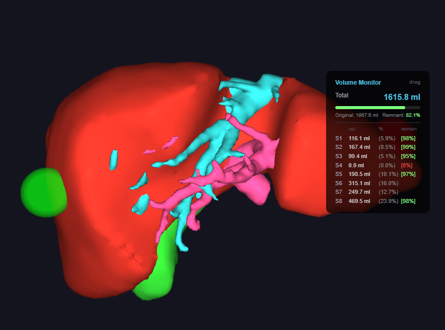

# Liver Surgery Simulator (Web)

This repository (`LiverSurgerySimWeb`) is the deployment of **BLISS**, the system described in the paper
*BLISS: A Browser-Based Cross-Platform Patient-Specific Liver Surgery Simulator with AR/VR Support*,
to be presented at the joint workshop on **Augmented Environments for Computer-Assisted Interventions**,
**Computer-Assisted Robotic Endoscopy**, **Context Aware Operating Theaters**, and
**Precise Mixed Reality for Surgical and Medical Interventions** (AE-CAI | CARE | OR 2.0 | PRiSM)
at MICCAI 2026, Strasbourg, France, 27 September 2026.

Real-time liver surgery simulation running in the browser via WebAssembly.

---
## Live Demo

**[Launch Simulator](https://meimeimei1223.github.io/LiverSurgerySimWeb/)** — latest version (continuously updated)

### 🎓 Guided Demo — start here if it is your first visit

**[demo-tutorial-v1 (guided snapshot)](https://meimeimei1223.github.io/LiverSurgerySimWeb/demo-tutorial-v1/)**

A frozen copy of the simulator whose tutorial menu opens automatically. Five
lessons (Camera & Controls / Display & Organs / Deform / Cut / Select & Cut)
guide you through the real interface: a ring points at the button to press and
advances when you press it, alongside a worked example built from screenshots.

| Resource | URL |
|---|---|
| Guided demo (runnable) | https://meimeimei1223.github.io/LiverSurgerySimWeb/demo-tutorial-v1/ |
| Git tag | `git checkout demo-tutorial-v1` |
| Snapshot README | [demo-tutorial-v1/README.md](demo-tutorial-v1/README.md) |

The same tutorial is available on the live demo above from the **🎓 Tutorial**
pill in the bottom-right corner; there it stays closed until you ask for it.
Best on desktop — phones get the worked-example panel only, and it is hidden
while immersed in VR/AR.

### 📄 Reproducibility — Frozen Snapshots for Paper

Two immutable snapshots are preserved at separate URLs, one for each
experimental category reported in the paper:

#### 1. Performance benchmark (FPS, cut latency, tetragedral mesh generation time)

**[paper-benchmark-v1 (live snapshot)](https://meimeimei1223.github.io/LiverSurgerySimWeb/paper-benchmark-v1/?bench=1)**

| Resource | URL |
|---|---|
| Live snapshot (runnable) | https://meimeimei1223.github.io/LiverSurgerySimWeb/paper-benchmark-v1/ |
| Deployed files (browsable) | https://github.com/meimeimei1223/LiverSurgerySimWeb/tree/paper-benchmark-v1 |
| Git tag (commit `54c80b7`) | `git checkout paper-benchmark-v1` |
| Snapshot README | [paper-benchmark-v1/README.md](paper-benchmark-v1/README.md) |

The snapshot is `index.html v286` + `benchmark.js v1.0.9` + the
`softbody.{js,wasm,data}` binaries built on 2026-04-30. Add `?bench=1` to
the URL to activate the floating performance measurement panel (📊).

#### 2. Anatomical volume measurement (20 cases × liver / tumor / S1–S8 / Other Organs)

**[paper-volume-v1 (live snapshot)](https://meimeimei1223.github.io/LiverSurgerySimWeb/paper-volume-v1/)**

| Resource | URL |
|---|---|
| Live snapshot (runnable) | https://meimeimei1223.github.io/LiverSurgerySimWeb/paper-volume-v1/ |
| Deployed files (browsable) | https://github.com/meimeimei1223/LiverSurgerySimWeb/tree/paper-volume-v1 |
| Git tag (commit `8fc9977`) | `git checkout paper-volume-v1` |
| Snapshot README | [paper-volume-v1/README.md](paper-volume-v1/README.md) |

The snapshot is `index.html v311` + the `softbody.{js,wasm,data}` binaries
built on 2026-05-19 (includes tumor-mask embind for live "Liver excluding
tumor" volume). The Volume panel's **Export JSON** button produces a
machine-readable record per case for offline aggregation.

Both snapshot URLs are **bit-frozen**; the live URL at the repository root
continues to evolve.

> ⚠️ **Research and educational use only — not a medical device.**
> This software has not been reviewed, cleared, or approved by any regulatory
> authority, and nothing it produces may be used to make a treatment decision.
> Loading your own patient-derived anatomy for research or educational review
> *is* supported: everything runs locally in your browser and the files you load
> are never transmitted anywhere — see
> [Using your own patient data](#using-your-own-patient-data).

## Quick Start



1. **[Click → Launch Simulator](https://meimeimei1223.github.io/LiverSurgerySimWeb/)**
2. The default liver model auto-loads (~10 s on desktop).
3. **Mouse drag** to rotate, **scroll** to zoom, **right-drag** to pan.
4. Press **`D`** → click the surface to place a handle → drag to deform.
5. Press **`X`** → drag to position the cutter → click **Execute Cut** to slice.
6. Press **`B`** to open the Volume panel (S1–S8 ml breakdown).

➡ For detailed step-by-step tutorials with screenshots, see **[USAGE.md](USAGE.md)**.

To load your own patient OBJ model, see [Loading Custom Models](#loading-custom-models) below.

---

## Features

- **Soft-body physics** — XPBD (Extended Position Based Dynamics) solver compiled from C++ to WebAssembly
- **Free Cut** — Place a 3D cutter and cut liver/portal/vein with fragment selection
- **Segment Cut** — Select portal segments (S1–S8) and cut by segment with volume calculation
- **Deform** — Place handle spheres and deform the liver interactively
- **Transform** — Rotate and translate the model using FullSphereCamera (quaternion, no gimbal lock)
- **Transparency** — Per-organ alpha control with depth-sorted rendering
- **Volume Display** — Real-time volume calculation with segment breakdown (ml / %)
- **Seg Overlay** — Visualize which segment the cutter is touching during Free Cut
- **OBJ Drop** — Drop custom OBJ files to tetrahedralize and simulate any liver model
- **Cross-platform** — Desktop browsers, Android (browser + AR passthrough), Quest3 (browser + immersive VR)

---

## Loading Custom Models

### Using your own patient data

Loading a real patient's anatomy for research or educational review is a supported
use of this software. Two properties make it practical in a hospital setting:

- **Nothing is uploaded.** Tetrahedralization, physics, and volume computation all
  run inside your browser through WebAssembly. The OBJ files you drop onto the page
  are read locally and are never transmitted to the author or to any third party;
  the application has no upload path for them.
- **Any segmentation software works.** Organs are recognised by filename (see
  [Naming convention](#naming-convention) below), so meshes exported from 3D Slicer,
  MeshLab, or a clinical workstation are all accepted. `liver.obj` and `portal.obj`
  alone are enough to begin. If your workstation exports STL rather than OBJ,
  3D Slicer or MeshLab converts it in one step.

Please observe the following when you do:

| | |
|---|---|
| ✅ | Use de-identified meshes — remove patient identifiers from file and folder names |
| ✅ | Follow your institution's rules for handling patient-derived data |
| ✅ | Treat computed volumes and segment boundaries as approximate, and check them against your own segmentation |
| ❌ | Do not let any output of this software inform a diagnosis, an operative plan, or a treatment decision |

Questions and academic collaboration are welcome — **meidai1223@gmail.com**.

### Folder structure

A complete liver model consists of organ OBJ files + optional pre-segmented S1–S8 files:

```
my_patient/
├── liver.obj      ← Parent mesh (REQUIRED)
├── portal.obj     ← Portal vein (strongly recommended)
├── vein.obj       ← Hepatic vein
├── tumor.obj      ← Tumor lesion
├── gb.obj         ← Gallbladder
│
├── S1.obj         ← Couinaud segment 1 (optional, for Preset Seg mode)
├── S2.obj         ← Segment 2
├── S3.obj         ← Segment 3
├── S4.obj         ← Segment 4
├── S5.obj         ← Segment 5
├── S6.obj         ← Segment 6
├── S7.obj         ← Segment 7
└── S8.obj         ← Segment 8
```

### Naming convention

Organ filenames are matched by **case-insensitive substring**:

| Detected as | Required? | Patterns that match |
|---|---|---|
| Liver | **REQUIRED** | `liver.obj`, `LIVER.obj`, `patient001_liver.obj`, `case_A_LIVER.obj` |
| Portal | Recommended (needed for Auto Seg) | `portal.obj`, `portal_vein.obj`, `PORTAL_VEIN.obj` |
| Vein | Optional | `vein.obj`, `hepatic_vein.obj`, `HV.obj` |
| Tumor | Optional | `tumor.obj`, `Tumor_1.obj`, `lesion_TUMOR.obj` |
| GB | Optional | `gb.obj`, `GB.obj`, `gallbladder.obj` |

Preset Seg files use a different rule: **first character `S` or `s`, second character a digit** (`0-9`).
So `S1.obj`, `S2.obj` … `S8.obj` (or `s1.obj` … `s8.obj`) all work. Variants like
`S1_lateral.obj` also match (only the first two chars are checked). All matching
files are auto-loaded if present in the folder.

### Two segmentation modes

The simulator supports two distinct segmentation methods, switchable at runtime via the **Normal / Auto Seg / Preset Seg** buttons:

| Mode | Source | Requires | Anatomical accuracy |
|---|---|---|---|
| **Normal** | No segmentation | — | — |
| **Auto Seg** | Skeleton analysis of portal vein tree | `portal.obj` | Approximate (algorithmic) |
| **Preset Seg** | Pre-segmented OBJ files | `S1.obj` … `S8.obj` | **High** (matches your input segmentation) |

For published anatomical accuracy, supply `S*.obj` files exported from your
segmentation software (e.g., 3D Slicer with the Liver Couinaud module).
Auto Seg is convenient when only `portal.obj` is available.

> ℹ️ Name the files `S1.obj` … `S8.obj`, as described under
> [Naming convention](#naming-convention). Do **not** add a `soft_` prefix: that
> prefix is applied internally by the tetrahedralizer after a file is recognised
> as a segment, and a file actually named `soft_S1.obj` is *not* detected as one.

> ℹ️ **Volume panel S1–S8 breakdown is only meaningful in Preset Seg mode** —
> the Auto Seg numbering does not necessarily match anatomical S1–S8.

### Drop method by platform

| Platform | Method |
|---|---|
| Desktop (Chrome / Firefox / Edge) | Drag the **folder** onto the page |
| Android Browser / AR | Tap the floating ➕ button → select extracted folder |
| Quest3 Browser / VR | Drag a **ZIP archive** onto the page (folder drop unsupported on Meta Browser) |

For Quest3 ZIP format:

```
my_patient.zip
└── my_patient/
    ├── liver.obj
    ├── portal.obj
    ├── ...
```

After dropping, choose a [tetrahedralization preset](#tet-density-presets) and click **Generate**.

➡ Full walkthrough including OBJ Drop modal screenshots: **[USAGE.md §1](USAGE.md#1-loading-a-model--full-walkthrough)**.

---

## Tet Density Presets

The tetrahedral grid resolution controls simulation accuracy vs. performance:

| Preset | Liver grid (low / high) | Sim tets | Visual tets | Recommended hardware |
|---|---|---|---|---|
| **Low** | 16 / 32 | ~3,665 | ~22,975 | Mobile phones, low-end laptops, Quest 3, AR mode |
| **Mid** | 20 / 40 | ~6,485 | ~42,070 | Modern desktop |
| **High** | 40 / 80 | ~42,070 | ~300,780 | Desktop with discrete GPU only |

> A preset sets the **voxel grid resolution, not a tetrahedron count**. The grid is fitted
> to each mesh's bounding box, so the counts above are for the benchmark model; the exact
> number varies with the size and shape of the loaded liver.

Higher density → smoother deformation and finer cuts, but proportionally more
CPU (physics) and GPU (rendering) load. See [Performance by Platform](#performance-by-platform)
for measured FPS on each preset.

On Quest 3 in immersive VR, **Low is the comfortable preset** (~27–30 FPS measured);
Mid drops to ~19–21 FPS and High to ~5 FPS. The same holds for Android AR, where Low
(~25–27 FPS) is the practical ceiling.

---

## Interaction Modes (summary)

| Mode | Key | What it does |
|---|---|---|
| **Deform** | `D` | Place handle spheres, drag to deform the liver in real time |
| **Free Cut** | `X` | Place a 3D cutter plane, slice liver / portal / vein |
| **Segment Cut** | `Q` then `Z` | Select Couinaud S1–S8 segments and resect them as a group |
| **Transform** | `T` | Rotate / translate the whole model |

➡ Step-by-step tutorials for each mode (with screenshots): **[USAGE.md §2–§5](USAGE.md)**.

---

## Controls

### Desktop (mouse + keyboard)

| Key / Mouse | Action |
|---|---|
| Left drag | Camera rotate / Grab mesh (in Deform mode) |
| Right drag | Camera pan |
| Scroll | Camera zoom |
| **D** | Deform mode (Handle Place) |
| **X** | Free Cut mode |
| **Q** | Seg Overlay (in Free Cut) / Segment Cut mode |
| **T** | Transform mode |
| **F** | Liver Select |
| **G** | Portal Select |
| **Z** | Execute Segment Cut |
| **K** | Clear Selection |
| **B** | Volume panel |
| F1 | Wireframe toggle |
| F2 | Reset shape |
| Esc | Exit immersive (VR/AR) |

### Mobile / Tablet (touch)

| Touch | Action |
|---|---|
| Single finger drag | Camera rotate |
| Two finger pinch | Zoom |
| Two finger drag | Camera pan |
| Tap a handle | Grab (Deform mode) |
| Drag a handle | Deform mesh |
| Tap mode buttons (bottom bar) | Switch modes |

UI is fully touch-accessible — no keyboard required.

### Immersive VR / AR

| Mode | Platform | Entry |
|---|---|---|
| **VR immersive** | Quest3 (Meta Browser) | Tap **VR** button |
| **AR passthrough** | Android (Chrome) | Tap **AR** button |

➡ Detailed VR / AR hand & touch controls: **[USAGE.md §7–§8](USAGE.md#7-quest3-vr-immersive)**.

---

## Performance by Platform

Measured idle FPS at the standardized benchmark workflow
([source: `?bench=1`](https://meimeimei1223.github.io/LiverSurgerySimWeb/paper-benchmark-v1/?bench=1)):

| Platform | Hardware | Low | Mid | High |
|---|---|---|---|---|
| Desktop Chrome | RTX 4070 | 58 | 60 | 28 |
| Desktop Firefox | RTX 4070 | 55 | 52 | 34 |
| Quest3 Browser 2D | Adreno 740 | 26 | 23 | 17 |
| Quest3 VR immersive | Adreno 740 | 30 | 21 | **5** |
| Android Browser | Adreno 710 | 34 | 32 | 9 |
| Android AR immersive | Adreno 710 | 27 | 15 | **3.5** |

➡ Cut compute times, mean ± std, full benchmark methodology: **[USAGE.md §9](USAGE.md#9-benchmark-mode-for-paper-measurement)**.

---

## Known Limitations (brief)

- **HIGH preset on mobile / HMD**: 3–17 FPS — usable for review, not real-time interactive
- **Quest3**: ZIP drop only (folder drop unsupported in Meta Browser)
- **Firefox**: GPU and CPU threads spoofed by Resist Fingerprinting (same RTX 4070 hardware, same performance as Chrome)
- **iOS Safari**: Not officially tested (WebGL2 + WebXR incomplete)
- **AR + fullscreen (mobile)**: Browser fullscreen and WebXR `dom-overlay` are mutually exclusive on Android Chrome. The AR button is intentionally blocked while fullscreen is active; tap the ⛶ button to exit fullscreen first.
- **Volume panel in VR (Quest3)**: Not yet ported to VR-native 3D panel — deferred (desktop / mobile / AR all supported)

➡ Full limitations + troubleshooting table: **[USAGE.md §10](USAGE.md#10-troubleshooting-extended)**.

## Technology

- **Physics**: C++ XPBD solver → WebAssembly (Emscripten)
- **Rendering**: WebGL 2.0 with depth-sorted transparency
- **Camera**: FullSphereCamera (quaternion rotation, no gimbal lock)
- **Segmentation**: Voxel skeleton analysis + OBJ S1–S8 Couinaud classification
- **Tetrahedralization**: CentVoxTetrahedralizerHybrid (in-browser, proprietary)

---

## License

This software is released under the **LiverSurgerySimWeb License**, a proprietary license with all rights reserved. The deployed HTML and JavaScript are readable in the browser and may be inspected to understand the interface; the C++ solver is distributed only as a compiled WebAssembly binary and its source is not published. See [LICENSE](LICENSE) for the complete terms.

### Key Points

| | |
|---|---|
| ✅ | Personal academic study is permitted |
| ✅ | Loading your own patient-derived meshes for research or educational review is permitted |
| ✅ | Citation is required in academic publications |
| ❌ | No copying, forking, cloning, or re-hosting |
| ❌ | No modifications or derivative works |
| ❌ | No reverse engineering or decompilation |
| ❌ | No use as AI / machine learning training data |
| ⚠️ | Commercial use, and clinical use on human patients, by prior written arrangement (see below) |
| ❌ | Not a medical device — not for clinical decision making |

### Commercial Licensing

The author welcomes inquiries from organizations interested in licensing this technology for:

- Commercial software products
- Medical device development and regulatory submission
- Integration into paid educational platforms
- Clinical research with appropriate regulatory oversight

For licensing inquiries, please contact: **meidai1223@gmail.com**

---

## Citation

If you reference this work in academic publications, please cite the paper:

> Kasai, M. (2026). *BLISS: A Browser-Based Cross-Platform Patient-Specific Liver Surgery Simulator with AR/VR Support.* To be presented at the AE-CAI | CARE | OR 2.0 | PRiSM Workshop, MICCAI 2026, Strasbourg, France, 27 September 2026.

To cite the implementation itself:

> Kasai, M. (2026). *LiverSurgerySimWeb: A browser-based liver surgery simulator with soft-body physics and segment-aware cutting.* [Software]. https://github.com/meimeimei1223/LiverSurgerySimWeb

## Disclaimer

This software is provided "as is" without warranty of any kind. It has not been reviewed, cleared, or approved by the PMDA, FDA, EMA, or any other regulatory authority. The soft-body physics simulation is a simplified model for educational and demonstrative purposes and does not accurately represent the biomechanical behavior of real human liver tissue.

**This software must not be used for clinical decision making or for the treatment of human patients.** Patient-derived anatomy may be loaded for research and educational review — see [Using your own patient data](#using-your-own-patient-data) — but nothing the software computes or displays may inform an operative plan or any other treatment decision.

---

## Third-Party Components

This project incorporates the following third-party libraries, statically compiled into `softbody.wasm`:

- [Dear ImGui](https://github.com/ocornut/imgui) — MIT License
- [GLM](https://github.com/g-truc/glm) — MIT License
- [stb](https://github.com/nothings/stb) — MIT License / Public Domain
- [tinyobjloader](https://github.com/tinyobjloader/tinyobjloader) — MIT License
- [GLEW](https://glew.sourceforge.net) — Modified BSD / MIT / SGI Free Software License B
- [GLFW](https://www.glfw.org) — zlib License

See [LICENSE](LICENSE) Section 6 for details.

---

## Contact

**Meidai Kasai, MD**
Email: meidai1223@gmail.com
Repository: https://github.com/meimeimei1223/LiverSurgerySimWeb
