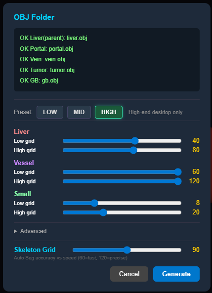
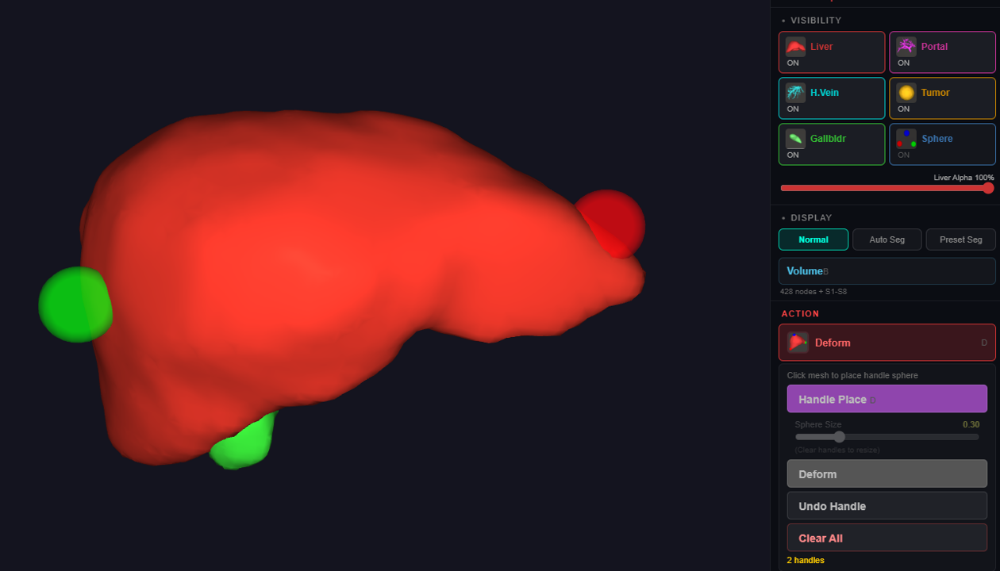
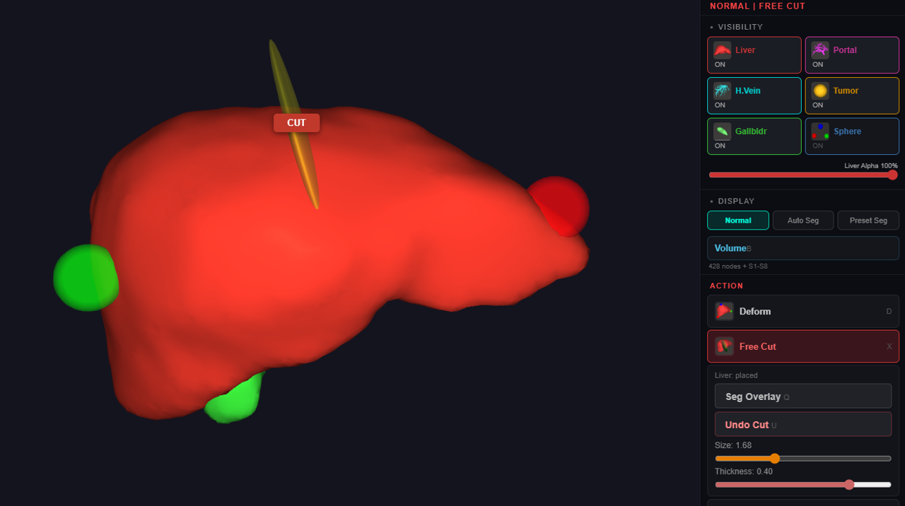
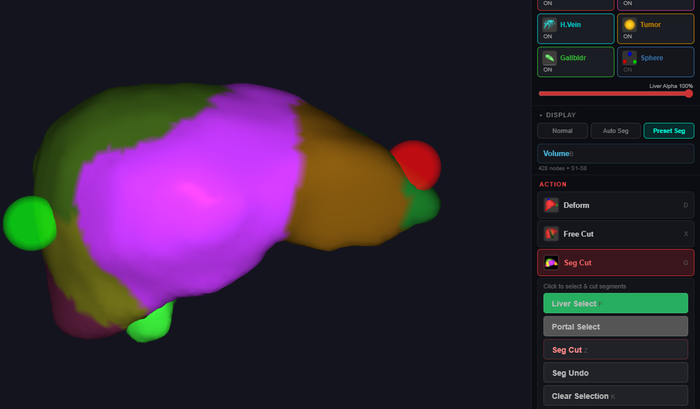

# Usage Guide — Detailed Tutorials & Screenshots

This page is the in-depth companion to [README.md](README.md).
README has the Quick Start, loading instructions, and reference tables;
this page walks through each interaction mode with screenshots and
explains common workflows step by step.

For installation / launch / control reference: see [README.md](README.md).

> 🎓 **Prefer to be shown rather than to read?** The
> [guided demo](https://meimeimei1223.github.io/LiverSurgerySimWeb/demo-tutorial-v1/)
> teaches the same workflows inside the running application: pick a lesson and a
> ring points at each button as you go. On the live demo the same tutorial waits
> behind the **🎓 Tutorial** pill in the bottom-right corner. Desktop browsers get
> the full guidance; phones show the worked-example panel only.

---

## Table of Contents

1. [Loading a model — full walkthrough](#1-loading-a-model--full-walkthrough)
2. [Deform workflow (handle drag)](#2-deform-workflow-handle-drag)
3. [Free Cut workflow (3D cutter plane)](#3-free-cut-workflow-3d-cutter-plane)
4. [Segment Cut workflow (Couinaud anatomical resection)](#4-segment-cut-workflow-couinaud-anatomical-resection)
5. [Volume panel and tumor visualization](#5-volume-panel-and-tumor-visualization)
6. [Mobile / Tablet usage](#6-mobile--tablet-usage)
7. [Quest3 VR immersive](#7-quest3-vr-immersive)
8. [Android AR passthrough](#8-android-ar-passthrough)
9. [Benchmark mode (for paper measurement)](#9-benchmark-mode-for-paper-measurement)
10. [Troubleshooting (extended)](#10-troubleshooting-extended)

---

## 1. Loading a model — full walkthrough


### Default model

When you visit the simulator URL for the first time without dropping anything,
a small **built-in liver model** is loaded automatically (~10 s on desktop).
This is suitable for trying out the controls but is smaller and lower-resolution
than typical patient data.

### Dropping a patient model

#### Desktop (Chrome / Firefox / Edge)

1. Prepare a folder containing your OBJ files (see [naming convention](#naming-convention) below).
2. Drag the **whole folder** onto the browser window.
3. The OBJ Drop modal appears.

#### Quest3 (Meta Browser, both 2D and VR)

The Meta Browser does **not** support folder drop, so you must ZIP the folder first:

```
my_patient.zip
└── my_patient/
    ├── liver.obj
    ├── portal.obj
    ├── vein.obj
    ├── tumor.obj
    └── gb.obj
```

1. Click the **OBJ Drop** area and pick the `.zip` file in the file picker.
2. `fflate.min.js` automatically extracts in-browser (typically <1 s).
3. The OBJ Drop modal appears.

> **The ZIP does not show up in the picker?** A file copied over USB (`adb push`,
> SideQuest) lands in `/sdcard/Download/` but the MediaStore row it creates is left
> flagged `is_pending=1`, and Android hides pending rows from every other app — so
> the file exists yet the picker cannot see it. Reboot the headset, or clear the
> flag from a PC:
>
> ```
> adb shell content call --uri content://media/external/file --method scan_file --arg /sdcard/Download/<file>.zip
> ```
>
> Downloading the ZIP in the headset's own browser avoids the problem entirely.

#### Android (Chrome on phone / tablet)

1. Extract the ZIP on your device beforehand (Files app → tap the ZIP).
2. Tap the floating **➕** button.
3. Choose the extracted folder via the system folder picker.

### Naming convention

#### Organ meshes (substring match, case-insensitive)

| Detected as | Required? | Patterns that match |
|---|---|---|
| Liver | **REQUIRED** | `liver.obj`, `LIVER.obj`, `patient001_liver.obj`, `case_A_LIVER.obj` |
| Portal | Strongly recommended (needed for Auto Seg) | `portal.obj`, `portal_vein.obj`, `patient001_PORTAL_VEIN.obj` |
| Vein | Optional | `vein.obj`, `hepatic_vein.obj`, `HV.obj` |
| Tumor | Optional | `tumor.obj`, `Tumor_1.obj`, `lesion_TUMOR.obj` |
| GB | Optional | `gb.obj`, `GB.obj`, `gallbladder.obj` |

If the auto-match is wrong, the modal lets you manually assign files.
Only **liver.obj** is strictly required; the others enable different feature sets:

- Without `portal.obj` → Auto Seg disabled (Segment Cut still works if Preset Seg files are provided)
- Without `tumor.obj` → Tumor row in Volume panel hidden
- Without `vein.obj` / `gb.obj` → those layers omitted (no functional impact)

#### Preset Seg meshes (S/s + digit pattern)

For **Preset Seg mode** (high-accuracy Couinaud segmentation), provide
pre-segmented liver sub-meshes in the same folder. The detection rule is simple:

> A file is treated as a Couinaud segment if its filename starts with
> **`S` or `s`** followed by a **digit (0–9)**.

Recommended filenames and their anatomical correspondence:

| Filename | Couinaud segment |
|---|---|
| `S1.obj` | S1 (caudate lobe) |
| `S2.obj` | S2 (left lateral superior) |
| `S3.obj` | S3 (left lateral inferior) |
| `S4.obj` | S4 (left medial) |
| `S5.obj` | S5 (right anterior inferior) |
| `S6.obj` | S6 (right posterior inferior) |
| `S7.obj` | S7 (right posterior superior) |
| `S8.obj` | S8 (right anterior superior) |

Variants that also work:

| Pattern | Example | Why it works |
|---|---|---|
| Lowercase | `s1.obj`, `s8.obj` | Either case is accepted |
| Trailing suffix | `S1_lateral.obj`, `s8_extracted.obj` | Only the first two chars are checked |

Patterns that do **not** work (no segment detection):

| Bad pattern | Why |
|---|---|
| `soft_S1.obj` | Starts with `s` but second char is `o`, not a digit |
| `Segment1.obj` | Starts with `S` but second char is `e` |
| `S_1.obj` | Second char is `_`, not a digit |
| `liver_S1.obj` | Starts with `l` |

> ℹ️ Internally, the simulator renames detected segment files to
> `/tmp/soft_S*.obj` in the WASM virtual filesystem (the `soft_` prefix is added
> automatically by the tetrahedralizer). You do **not** need to use this prefix
> in your source filenames.

All matched files are auto-loaded after the main liver is generated.
The loading-status bar reports `+ S1-S8` when binding succeeds.

If no segment files are detected, the simulator falls back to **Auto Seg**
(skeleton-based segmentation from `portal.obj`), which is approximate.

### Two segmentation modes

After loading, the **Visual Mode** toolbar (top-right) lets you switch between:

| Button | Mode | Source | Anatomical accuracy |
|---|---|---|---|
| Normal | No segmentation | — | — |
| Auto Seg | Auto segment from portal vein skeleton | `portal.obj` | Approximate (algorithmic) |
| **Preset Seg** | Pre-segmented OBJ | `S1.obj`–`S8.obj` | **High** (matches input segmentation) |

The Preset Seg button is **greyed out** if no `S*.obj` files were detected
(remember: name them `S1.obj`, not `soft_S1.obj` — see the tables above).

> ⚠️ **Important for clinical / paper interpretation**: the S1–S8 labels in the
> Volume panel correspond to **Preset Seg** anatomy only. Auto Seg's segment
> numbering is geometric (based on portal branch counts), not Couinaud anatomy,
> so do not interpret "Auto Seg S5" as anatomical Couinaud segment 5.

### Choosing a tetrahedralization preset



| Preset | Liver grid (low / high) | Sim tets | Visual tets | Tet generation time (desktop) | Recommended hardware |
|---|---|---|---|---|---|
| **Low** | 16 / 32 | ~3,665 | ~22,975 | ~5 s | Mobile, low-end laptops, Quest 3, AR |
| **Mid** | 20 / 40 | ~6,485 | ~42,070 | ~10 s | Modern desktop |
| **High** | 40 / 80 | ~42,070 | ~300,780 | ~40 s | Desktop with discrete GPU only |

> The preset buttons only move the **Liver / Vessel / Skeleton grid sliders** shown in the
> same dialog — they set a voxel grid resolution, not a tetrahedron count. Because the grid
> is fitted to each mesh's bounding box, the tet counts above are those of the benchmark
> model; the exact number varies with the size and shape of the loaded liver.

Click **Generate**. Progress is shown in the loading bar. The simulation
becomes interactive when "First interactable" appears in the console.

---

## 2. Deform workflow (handle drag)



### Steps

1. Press **`D`** to enter Deform mode (or click the **Deform** button in the toolbar).
2. The mode has two sub-modes: **Handle Place** (default) and **Deform**.
3. **Handle Place**: click anywhere on the liver surface — a colored handle sphere appears at that point. Place as many as you want.
4. **Deform**: click on a handle and drag — the surrounding mesh deforms in real time using XPBD soft-body physics.
5. To remove handles, use the Action panel: **Undo Handle** removes the last one,
   **Clear All** removes every handle. (The **`K`** key clears the *segment
   selection* used in Segment Cut mode, not handles.)

### Tips

- Handles are sticky: they stay attached to the underlying tet even after deformation.
- The smaller the handle, the more localized the deformation.
- You can place multiple handles and pull them in different directions for compound deformation.

---

## 3. Free Cut workflow (3D cutter plane)



### Steps

1. Press **`X`** to enter Free Cut mode.
2. **Click the liver** where you want to cut — a semi-transparent **cutter quad**
   is placed there, with a floating **CUT** button next to it.
3. Adjust the cut:
   - Drag the cutter itself to move it; rotate the camera to align the plane.
   - The **Size** and **Thickness** sliders in the side panel adjust the blade.
4. Press the floating **CUT** button. The liver is sliced along the cutter plane.
5. If the cut produces multiple disconnected fragments, a **Fragment Selection** popup appears:
   - Each fragment is highlighted with a number.
   - Click the fragment you want to **keep** (the others are discarded).

### Seg Overlay (visual aid during Free Cut)

While in Free Cut mode, press **`Q`** to toggle the **Seg Overlay**:
- The liver re-colors to show which Couinaud segments the cutter is currently intersecting.
- Useful for "I want to cut along the S5/S6 boundary" type planning.

---

## 4. Segment Cut workflow (Couinaud anatomical resection)



### Steps

1. Click the **Seg Cut** button in the toolbar, or press **`F`** (Liver Select) /
   **`G`** (Portal Select) — either selection shortcut switches to Segment Cut
   mode automatically.
2. The liver re-colors to show **S1–S8** segments. Which segmentation is used depends
   on the files you loaded (see [Two segmentation modes](#two-segmentation-modes)):
   - If `S1.obj` … `S8.obj` files were loaded, **Preset Seg** shows that anatomy.
   - Otherwise **Auto Seg** applies: a voxel-based skeleton analysis of `portal.obj`
     assigns each tet to the nearest portal branch.
3. **Click** on a segment to **select** it (it brightens). Click again to deselect.
4. Multi-select is supported — typically you select adjacent segments for an anatomical resection (e.g., S5+S6+S7+S8 = right hepatectomy).
5. Press **`Z`** to execute the cut. Selected segments are removed.
6. Open the Volume panel (**`B`**) to see:
   - Remnant liver volume (ml)
   - Resected volume (ml + % of original)

### Tips

- Auto-segmentation quality depends on portal vein mesh completeness.
- For published anatomical accuracy, supply pre-segmented `S1.obj` … `S8.obj` files
  exported from clinical segmentation software and use **Preset Seg**.
- Use Free Cut for non-anatomical cuts (wedge resections, etc.).

---

## 5. Volume panel and tumor visualization


### Opening

Press **`B`** or click the **Volume** button. The panel is draggable.

### Contents

| Row | Meaning |
|---|---|
| **Total** | Current liver volume in ml |
| **Original** | Liver volume at load (snapshot) |
| **Remnant** | Current / Original × 100% |
| **S1–S8** | Per-segment volume + percentage |
| **Liver (excl. tumor)** | Live liver volume minus the tumor-overlap volume (shown when a tumor mesh overlaps the liver) |
| **Portal / Vein / Tumor / GB** | Initial volume of other organs (captured once at load) |

### Color coding

- **Green** (✓): volume within 90–110% of original — normal post-cut
- **Yellow** (⚠): 80–120% — minor deformation
- **Red** (✗): outside 80% — significant change (intentional resection or error)

### Tumor visualization

Toggle tumor opacity via the **Visibility** button (top-right) → tumor slider.

> The **Liver (excl. tumor)** row appears whenever a loaded tumor mesh overlaps
> the liver: a voxel mask of the overlap is built at load time, and the row shows
> the live liver volume minus that overlap. It updates lazily while the panel is
> open, so it stays correct after cuts and deformation.

---

## 6. Mobile / Tablet usage

### Touch reference

| Touch | Action |
|---|---|
| Single finger drag | Camera rotate |
| Two finger pinch | Zoom |
| Two finger drag | Camera pan |
| Tap a handle | Grab (Deform mode) |
| Drag a handle | Deform mesh |
| Tap mode buttons (bottom bar) | Switch modes |
| Tap ➕ button | Submenu (Volume, Visibility, Reset) |

### Tips

- UI is fully touch-accessible — no keyboard required.
- The bottom toolbar contains all the same modes as the desktop keyboard shortcuts.
- For best performance on mobile, use the **Low** preset.
- Folder drop is unsupported in mobile browsers; use the ➕ button to pick an extracted folder.

---

## 7. Quest3 VR immersive

### Entry

1. Open the simulator URL in **Meta Browser** on Quest3.
2. Load a model (see [Loading](#1-loading-a-model--full-walkthrough)).
3. Choose preset (recommend Low or Mid for VR).
4. Click **Generate** → wait for tet generation.
5. Tap the **VR** button (visible when WebXR `immersive-vr` is supported).

### Hand controls

| Action | Effect |
|---|---|
| Right hand pinch + drag on handle | Grab + deform |
| Left hand pinch + drag in empty space | Rotate / translate the entire model |
| Right index pinch on cutter | Place / move cutter |
| Pinch on side-panel button | Activate UI button |
| Both hands pinch + spread/squeeze | Scale model |

### Tips

- Hand tracking is preferred over controllers (more intuitive for surgical gestures).
- The side panel is anchored to the left of the main panel. Both follow your head.
- For comfortable use, sit and keep movements small.
- **Use the Low preset here.** Measured in immersive VR: Low ~27–30 FPS, Mid ~19–21 FPS.
- High preset on Quest3 VR is ~5 FPS — usable for static observation only.

### Exit

Press the menu button on the right controller (or remove the headset) to exit VR mode.
The benchmark report button (📊) reappears in flat-screen mode after exit.

---

## 8. Android AR passthrough

### Requirements

- ARCore-supported Android device (Chrome 90+).
- Camera permission.
- Adequate lighting for plane detection.

### Entry

1. Open the simulator URL in **Chrome on Android**.
2. Load a model and Generate.
3. Tap the **AR** button (visible when WebXR `immersive-ar` is supported).
4. Move the phone to scan a flat surface — a reticle indicates the placement target.
5. Tap to anchor the liver on the surface.

### Touch controls

| Touch | Effect |
|---|---|
| Tap on handle | Grab (then drag to deform) |
| Tap on empty mesh surface | Place new handle (Handle Place sub-mode) |
| Two finger pinch | Scale model |
| Tap panel buttons (DOM overlay) | Standard UI |
| Tap **Exit** | Return to flat-screen browser mode |

### Tips

- AR is best for visual demonstration to colleagues / patients (immersive viewing).
- Performance is preset-dependent: Low ~27 FPS, Mid ~15 FPS, High ~3.5 FPS.
- The same DOM overlay UI from browser mode is available in AR — no separate AR-specific UI to learn.

---

## 9. Benchmark mode (for paper measurement)

When the URL has `?bench=1`, a floating **📊 Bench** button appears at the bottom-right corner.

### Workflow

1. Append `?bench=1` to the URL: `https://.../LiverSurgerySimWeb/?bench=1`
2. Drop your model and Generate.
3. Perform the standardized interaction sequence:
   - 10 s **idle** (no interaction)
   - 10 s **rotation** (camera or hand rotation)
   - 10 s **deform** (place + drag handles)
   - 3× **Free Cut**
   - 1× **Segment Cut**
4. Click the **📊** button → **Download JSON** (or **Copy JSON / MD**).
5. The JSON contains per-second FPS samples per activity bucket, cut compute times, XR session details, and platform fingerprint.

### Reproducible deployment

For exact paper reproducibility, use the frozen snapshot URL:

```
https://meimeimei1223.github.io/LiverSurgerySimWeb/paper-benchmark-v1/?bench=1
```

This is the bit-frozen v286 deployment used to collect the data in the paper
to be presented at the AE-CAI | CARE | OR 2.0 | PRiSM Workshop (MICCAI 2026).

---

## 10. Troubleshooting (extended)

| Symptom | Cause / Fix |
|---|---|
| Black screen on load | WebGL2 not supported. Update browser. Check `chrome://gpu` for blacklist entries. |
| Drop doesn't trigger | Folder must contain at least one file with "liver" in the name. Re-drop the same folder works in v282+. |
| Quest3 VR button missing | WebXR `immersive-vr` not detected. Ensure Meta Browser is updated and dev-mode is on if needed. |
| Android AR button missing | ARCore not installed or device unsupported. Check `chrome://flags` for WebXR AR. |
| Cut button greyed out | Cutter must intersect the mesh. Drag the cutter into the liver first. |
| FPS very low after first load | Browser still warming up (texture upload, JIT compilation). Wait 30 s and re-measure. |
| Volume shows 0 ml | `scaleFactor` not yet applied. Reload after the model finishes generating. |
| VR side panel hides the liver | Fixed in v287 (draw order change). Hard-reload (Ctrl+Shift+R) to clear SW cache. |
| Service Worker stuck on old version | DevTools → Application → Service Workers → Unregister → reload. |
| HIGH preset crashes Quest3 | Adreno 740 may run out of GPU memory at ~300K visual tets. Use Mid instead. |
| OBJ drop modal doesn't appear | Open DevTools console — check for "Failed to load OBJ" errors. Some OBJ exporters (e.g., Blender with grouping options) produce non-standard files. |
| Firebase / cloud model loading fails | The optional cloud model storage is **currently suspended**. Load models by local folder / ZIP drop instead — no feature in this guide requires it. |
| Tet generation hangs >60 s | HIGH preset on slow CPU. Lower to Mid or wait. WASM lacks threads, so it's single-threaded. |

If you encounter an issue not listed here, please open an issue at:
https://github.com/meimeimei1223/LiverSurgerySimWeb/issues
(include browser console log, platform, URL, and steps to reproduce).

---

## Screenshots inventory (checklist for the maintainer)

| # | File | Captures | Status |
|---|---|---|---|
| 01 | `01_main_ui.png` | Liver with Volume panel (S1–S8 + Remnant) | ✅ done |
| 02 | `02_load_dialog.png` | OBJ Drop modal — file list, preset buttons (HIGH), grid sliders | ✅ done |
| 03 | `03_deform.png` | Deform mode with handle spheres + Action panel | ✅ done |
| 04 | `04_freecut.png` | Free Cut cutter intersecting liver + CUT button | ✅ done |
| 05 | `05_segcut.png` | Preset Seg color mode (S1–S8 distinct colors) + Seg Cut panel | ✅ done |
| 06 | `06_volume_panel.png` | Volume Monitor panel detailed view | ✅ done |
| 07 | `07_mobile_ui.png` | Android landscape with mode toolbar | ⏳ needed |
| 08 | `08_vr_view.png` | Quest3 VR view (hand tracking + panels behind objects) | ⏳ needed |
| 09 | `09_ar_view.png` | Android AR with liver anchored on table | ⏳ needed |
| 10 | `10_bench_panel.png` | Benchmark report panel (📊) open | ⏳ needed |

PNG files live in `docs/screenshots/`. README and USAGE.md reference them via
relative paths so they render in both GitHub web view and clones.
